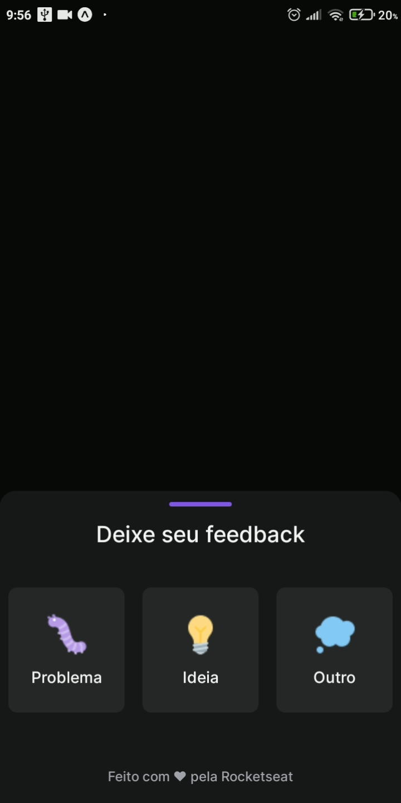

# Versão mobile do projeto nlw return trilha impulse

## Nesse projeto criamos um botão que quando o usuário clica abre um painel onde o mesmo pode escolher uma opção e deixar o seu feedback  

<h1 align="center">
  
</h1>

#### DEPENDÊNCIAS: 

- @expo-google-fonts/inter": "^0.2.2"
- @gorhom/bottom-sheet": "^4"
- axios": "^0.27.2"
- expo": "~44.0.0"
- expo-app-loading": "~1.3.0"
- expo-file-system": "~13.1.4"
- expo-font": "~10.0.4"
- expo-status-bar": "~1.2.0"
- phosphor-react-native": "^1.1.1"
- react": "17.0.1"
- react-dom": "17.0.1"
- react-native": "0.64.3"
- react-native-gesture-handler": "~2.1.0"
- react-native-iphone-x-helper": "^1.3.1"
- react-native-reanimated": "~2.3.1"
- react-native-svg": "12.1.1"
- react-native-view-shot": "3.1.2"
- react-native-web": "0.17.1"
#### DEV DEPENDÊNCIAS:

- @babel/core": "^7.12.9"
- @types/react": "~17.0.21"
- @types/react-native": "~0.64.12"
- typescript": "~4.3.5"
##

#### INSTALE OS PACOTES USANDO: npm install
#### PARA EXECUTAR O PROJETO LOCAL USE O COMANDO: expo start  

Para rodar o programa baixe o app Expo Go no seu celular,  
o app está disponível para android e IOS.   

:warning: O axios pode não conseguir enviar as info para o banco de dados  
porque foi módificado de SQLite para postgresql no projeto server

