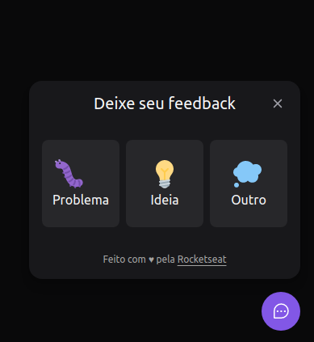

# Versão web do projeto nlw return trilha impulse

### Nesse projeto criamos um botão que quando o usuário clica abre um painel onde o mesmo pode escolher uma opção e deixar o seu feedback  

<h1 align="center">
  
</h1>

#### DEPENDÊNCIAS: 

- @headlessui/react": "^1.6.0"
- axios": "^0.27.2
- html2canvas": "^1.4.1
- phosphor-react": "^1.4.1"
- react": "^18.0.0
- react-dom": "^18.0.0
 
#### DEV DEPENDÊNCIAS

- @tailwindcss/forms": "^0.5.0"
- @types/react": "^18.0.0"
- @types/react-dom": "^18.0.0"
- @vitejs/plugin-react": "^1.3.0"
- autoprefixer": "^10.4.6"
- post": "^0.0.1"
- postcss": "^8.4.13"
- tailwind-scrollbar": "^1.3.1"
- tailwindcss": "^3.0.24"
- typescript": "^4.6.3",
- vite": "^2.9.5"

##

#### INSTALE OS PACOTES USANDO: npm install
#### PARA EXECUTAR O PROJETO LOCAL USE O COMANDO: npm run dev
#### PARA VER O PROJETO NO BROWSER ACESSE: http://localhost:3000/
